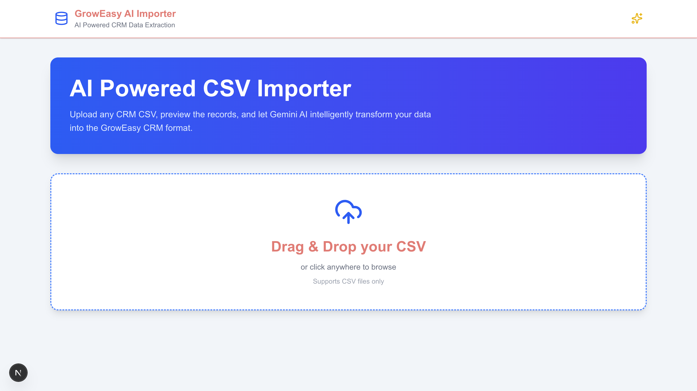
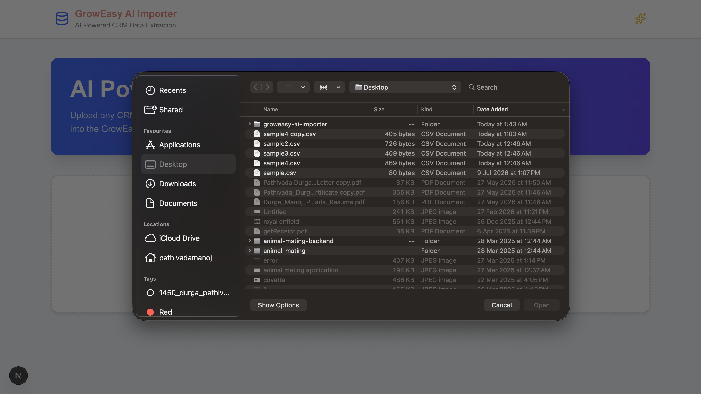
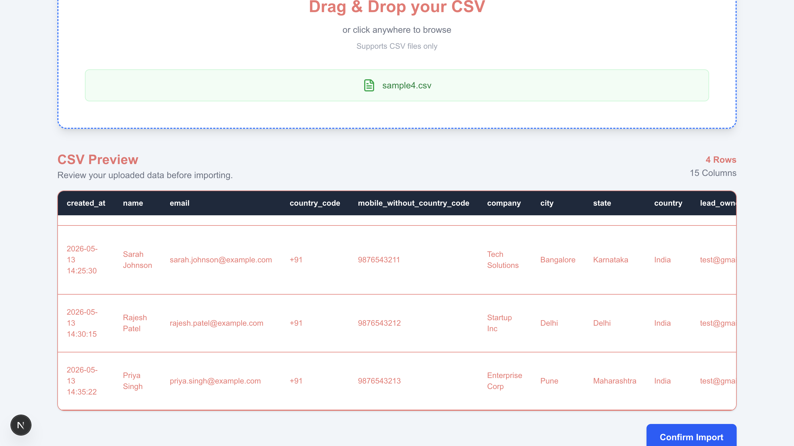
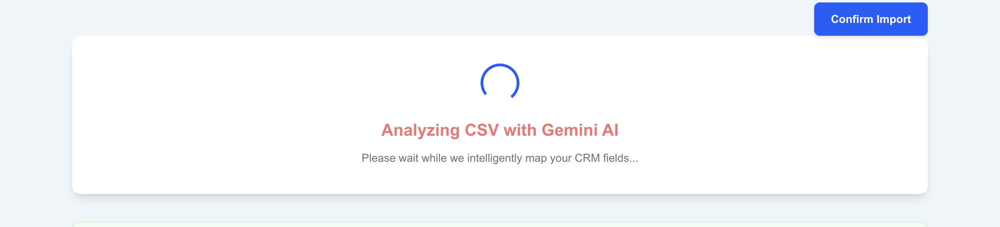
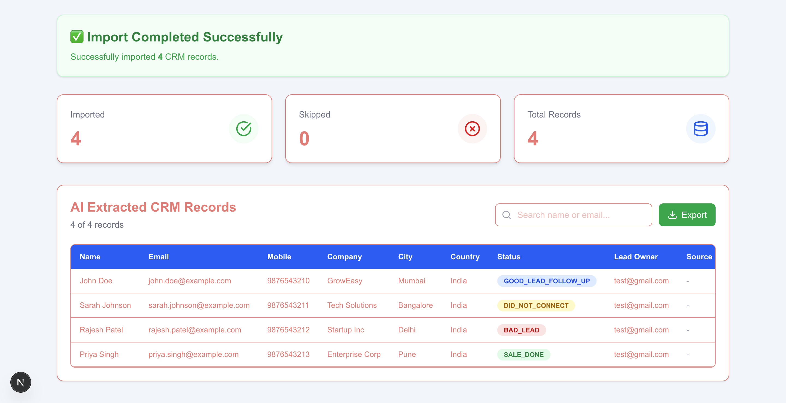

# 🚀 GrowEasy AI CSV Importer

An AI-powered CSV Importer built with **Next.js**, **Node.js**, **Express**, and **Google Gemini AI**. The application enables users to upload CRM CSV files, preview the data, analyze it using AI, and confirm the import through a clean, responsive interface.

---

## ✨ Features

- 📁 Upload CSV files
- 📋 Preview CSV data before importing
- 🤖 AI-powered data analysis using Google Gemini
- 📊 Statistics dashboard
- ✅ Confirm import workflow
- 🎨 Responsive user interface
- ⚠️ Request validation and error handling
- 📜 Backend request logging

---

## 🛠 Tech Stack

### Frontend

- Next.js 16
- React
- TypeScript
- Tailwind CSS
- Axios
- React Dropzone
- Lucide React

### Backend

- Node.js
- Express.js
- TypeScript
- Multer
- csv-parser
- Google Gemini API
- Zod
- Morgan

---

# 📂 Project Structure

```text
groweasy-ai-importer/
│
├── frontend/
│   ├── src/
│   │   ├── app/
│   │   ├── components/
│   │   ├── services/
│   │   └── types/
│   └── package.json
│
├── backend/
│   ├── src/
│   │   ├── controllers/
│   │   ├── routes/
│   │   ├── services/
│   │   └── server.ts
│   ├── package.json
│   └── .env
│
└── README.md
```

---

# 📸 Screenshots

## Home Page



---

## Upload CSV



---

## CSV Preview



---

## Import Conformation



---


## Import Result



---

# ⚙️ Prerequisites

Before running the project, install:

- Node.js 20+
- npm
- Git

---

# 🔧 Installation

## Clone the Repository

```bash
git clone https://github.com/Manoj-337/groweasy-ai-importer.git

cd groweasy-ai-importer
```

---

## Backend Setup

```bash
cd backend

npm install
```

Create a `.env` file inside the backend folder.

```env
PORT=5001
GEMINI_API_KEY=YOUR_GEMINI_API_KEY
```

Start the backend server:

```bash
npm run dev
```

Backend runs on:

```
http://localhost:5001
```

---

## Frontend Setup

```bash
cd frontend

npm install

npm run dev
```

Frontend runs on:

```
http://localhost:3000
```

---

# 📡 API Endpoint

| Method | Endpoint | Description |
|---------|----------|-------------|
| POST | `/upload` | Upload CSV file |
| POST | `/import` | Confirm data import |

---

# 🧪 Sample CSV

Example:

```csv
ProductID,ProductName,Category,Price,Stock
P1001,Laptop,Electronics,899.99,25
P1002,Mouse,Electronics,24.99,100
P1003,Keyboard,Electronics,49.99,75
```

---

# 🚀 Future Improvements

- Authentication
- Database integration
- Import history
- Export reports
- Progress indicator
- Multiple file upload

---

# 👨‍💻 Author

**Durga Manoj Pathivada**

GitHub: https://github.com/Manoj-337